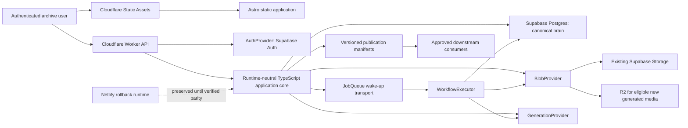

# Creative OS architecture contract

Status: approved architectural direction; enacted incrementally

Contract owner: EGGS / Para archive owner

Runtime contract: version `1` (unchanged by this document)
Evidence baseline: [`docs/evidence/creative-os-architecture-baseline-2026-08-09.json`](evidence/creative-os-architecture-baseline-2026-08-09.json)

This document is the durable architecture contract for Creative OS. It distills the Master Creative OS Architecture and Enactment Plan into decisions that implementation PRs must preserve. It does not promote archive material to foundation canon, change the database runtime contract, or authorize a deployment.

## 1. Mission

Creative OS is the evidence-preserving operating system for the EGGS / Para creative archive. It must make creative concepts, source artifacts, versions, relationships, decisions, rights, reviews, project use, and publication state traceable without confusing file presence or polish with canon.

The system is read-heavy and content-first. It should first make classification and retrieval reliable, then add composable creative graph and generation workflows. Source material, contradictory ideas, retired ideas, and review history remain discoverable. Unknown rights remain internal-only. The domain rules in `ARCHIVE_FOUNDATION_SPEC.md` remain authoritative for archive interpretation.

## 2. Canonical ownership of truth

| Concern | Canonical owner | Non-canonical roles |
|---|---|---|
| Creative history, graph state, artifact/version identity, provenance, review, approval, publication, workflow state | Supabase/Postgres project `okqkljexfzolzxysjaha` | Runtime caches and generated views |
| Binary bytes | Blob provider selected by storage policy | Signed URLs and CDN responses are temporary delivery mechanisms |
| Source-control history and architecture contracts | `simply0307/Creative-Systems1` | Dated evidence snapshots |
| Runtime request handling | Current: Netlify Functions. Target: Cloudflare Worker | Neither runtime owns creative truth |
| Identity proof | Current: Netlify Identity. Target: Supabase Auth | Authorization remains server-controlled |
| Static site output | Build artifacts deployed as static assets | Static output is not canonical creative state |

Supabase/Postgres is an intentional canonical dependency: it is the Creative OS brain. Do **not** introduce a generic database-provider abstraction. Postgres-specific strengths—transactions, constraints, append-only history, relational joins, JSONB where variability is real, and later pgvector—are part of the design.

## 3. Target runtime topology

Static assets must normally bypass Worker execution. Dynamic `/api/*` traffic enters the Worker, passes fail-closed runtime and identity checks, and calls the runtime-neutral core. Netlify remains operational rollback infrastructure until Cloudflare **and** Supabase Auth parity are measured and approved.

## 4. Decision boundaries

### Fixed dependency

- Supabase/Postgres owns canonical Creative OS state and history.
- Domain code may use Postgres capabilities intentionally.
- No `DatabaseProvider`, generic repository universe, or lowest-common-denominator persistence layer is planned.

### Replaceable boundaries

Future implementation may add only narrowly scoped interfaces at real vendor or execution boundaries:

| Boundary | Responsibility | Must not own |
|---|---|---|
| `RuntimeAdapter` | Translate host request/context/environment into the core and translate its response back | Domain policy, provenance, workflow state |
| `AuthProvider` | Verify identity and return trusted server-side claims | Canon authority or user-editable roles |
| `BlobProvider` | Put/get/head/delete/sign bytes and report stable blob references | Artifact identity or approval |
| `GenerationProvider` | Submit generation requests and normalize provider results | Prompt history, provenance, retry policy |
| `JobQueue` | Deliver wake-up messages with idempotency keys | Durable job or workflow truth |
| `WorkflowExecutor` | Advance resumable runs from canonical state | Queue transport or UI review decisions |

These names establish seams, not an instruction to implement them all. A boundary is added when a concrete milestone needs it and contract tests can prove parity.

## 5. Architectural invariants

The following laws are mandatory unless a later approved architecture decision explicitly supersedes one:

1. Postgres owns canonical creative history.
2. Runtime providers never own provenance.
3. Queue messages never own workflow state.
4. Blob URLs are not artifact identity.
5. Artifacts and artifact versions are distinct.
6. Definitions, instances, versions, and runs are distinct.
7. Every generated output points to exact input versions.
8. Historical runs never resolve `latest`.
9. Rendered prompts are immutable run evidence.
10. Provider-specific APIs do not leak into graph semantics.
11. Ports describe valid flow; provenance records actual history.
12. Similarity does not imply provenance or canon.
13. Published assets reference approved immutable versions.
14. Unknown rights default to internal-only.
15. Authentication and authorization fail closed.
16. Privileged roles are server-controlled.
17. Normal page loads never mutate canonical state.
18. Immutable historical records are appended, not overwritten.
19. Netlify remains rollback infrastructure until Cloudflare and Supabase Auth achieve verified parity.
20. New infrastructure must earn its complexity against a concrete milestone.

Wording is intentionally provider-neutral where the law concerns history or domain truth. The one provider-specific dependency—Postgres—is explicit because the approved architecture treats it as canonical, not replaceable.

## 6. Creative Graph model

The future Creative Graph is a typed, versioned relational graph in Postgres. It is not a graph database and is not implemented by placeholder tables in this phase.

**Definition ≠ instance ≠ version ≠ run.**

| Concept | Meaning |
|---|---|
| `NodeDefinition` | Stable identity and input/output contract for a reusable node type |
| `NodeDefinitionVersion` | Immutable implementation/configuration contract for that definition |
| `NodeInstance` | A node placed and configured in a graph |
| `NodeVersion` | Immutable snapshot of one node instance's configuration |
| `TypedEdge` | Constrained directional relationship between compatible ports |
| `GraphVersion` | Immutable set of exact node versions and typed edges |
| `NodeRun` | One execution attempt of one exact node version within a run |
| `WorkflowRun` | Durable orchestration state for execution across graph nodes and human waits |
| `ArtifactVersion` | Immutable metadata/content identity for one historical artifact state |
| `GenerationRun` | Exact provider request/result history tied to inputs and outputs |
| `PromptVersion` | Immutable reusable prompt template and variable contract |
| `RenderedPromptSnapshot` | Exact prompt text/messages sent during a run |
| `ProvenanceRelationship` | Evidence that one exact version derived from, used, transformed, or referenced another |
| `BlobRef` | Stable provider-qualified reference to stored bytes and checksum |
| `Review` | Human evaluation record; separate from approval authority |
| `Approval` | Explicit scoped authorization for use or publication |
| `PublicationVersion` | Immutable manifest of approved exact versions exposed to consumers |

Typed ports constrain what *may* flow. A provenance relationship records what *actually* happened. Neither typed edges nor embedding similarity may invent historical derivation.

## 7. Version and provenance model

- Stable identity rows remain addressable while immutable version rows accumulate.
- A run resolves all inputs before execution and stores their exact version IDs.
- `latest` is a drafting convenience only; it is never re-resolved when reading historical runs.
- Prompt templates are independently versioned. Each generation run also stores the rendered prompt snapshot, normalized parameters, provider/model identifier, timestamps, status, errors, and produced artifact version IDs.
- Checksums identify bytes; they do not substitute for artifact or version IDs.
- Material renames, merges, splits, promotions, retirements, and guardrail changes remain decision-log events.
- Archive canon authority and review condition remain separate dimensions.

## 8. Blob and storage strategy

The existing five private Supabase Storage buckets and their current objects remain in place. PRs must not destructively move them merely to simplify a provider migration.

`BlobRef` will eventually hold provider, bucket/container, object key, checksum, size, media type, and creation evidence. Artifact versions reference blob identities; signed URLs are short-lived presentation data created on demand.

The first `BlobProvider` implementation wraps current Supabase Storage. R2 may become the default for eligible **new generated media** after the boundary and parity tests exist. Migration of existing bytes is a separate, reversible, checksum-verified project. Unknown or unresolved rights never become public because a blob was copied.

## 9. Generation-provider strategy

Generation is a future orchestration capability, not a direct API call from graph semantics. A `GenerationProvider` accepts a normalized generation request and returns normalized provider evidence. Provider-specific fields stay in provider metadata.

The application owns prompt versions, rendered snapshots, resolved input versions, retry/idempotency policy, generation status, provenance, review, and approval. Generated outputs begin unapproved with rights/provenance review requirements. Adding a provider requires a concrete node milestone, cost controls, deterministic fixtures, and failure-mode tests.

## 10. Queue, execution, and human review

Postgres owns job, node-run, and workflow-run state. A queue carries only a small wake-up envelope such as run ID, attempt, and idempotency key. Workers load canonical state, claim work transactionally, append results, and make retries safe.

The first expected queue transport is Cloudflare Queues because it aligns with the target runtime, but the `JobQueue` seam must keep transport out of domain semantics. Supabase Queues, Cloudflare Workflows, and Durable Objects remain deferred until measured requirements justify them.

Human review is a durable wait state in Postgres:

1. An executor appends a review request and marks the run waiting.
2. A reviewer records a review and, where authorized, a separate approval or rejection.
3. The executor is awakened with the run ID.
4. It re-reads canonical state and resumes idempotently from the approved version.

Current operational `review_requests` concern present-day artifact operations. They are not silently redefined as future creative asset `Review`/`Approval` records.

## 11. Semantic memory

Relational truth and typed provenance come first. pgvector may later index approved textual/image representations for retrieval suggestions. Embeddings are derived, replaceable indexes with model/version metadata. Similarity results must never create provenance, canon, approval, or publication automatically.

## 12. Publication boundary

Consumers do not read arbitrary canonical tables directly. A `PublicationVersion` pins exact approved artifact and graph-derived versions, scope, audience, rights decision, approver, and manifest checksum. Consumer APIs and static exports expose only a selected publication version.

Publishing creates a new immutable manifest. Updating a draft or approving a later artifact version does not rewrite a previously published manifest. Revocation or replacement is an appended decision with an explicit successor.

## 13. Language strategy

- TypeScript is the application, API, adapter, workflow, graph-contract, and test language.
- SQL is used deliberately for schema, constraints, transactions, RLS, indexes, and read models.
- Astro remains the static presentation/build layer.
- JSON is used for portable manifests and evidence snapshots, not as an unbounded substitute for stable relational structure.
- Python is allowed for bounded offline media/data tooling when its ecosystem is materially better; it does not become a second application runtime by default.
- Provider SDK types terminate at adapter boundaries. Domain types use Creative OS vocabulary.

## 14. Current-to-target migration map

Existing tables and behavior are preserved while the target model is introduced additively in later reviewed migrations.

| Current capability | Current limitation | Target relationship |
|---|---|---|
| `artifacts` | Combines stable identity with mutable latest metadata and storage representation | Preserve rows; introduce immutable `ArtifactVersion` and `BlobRef`, then map current state as an initial version |
| `storage_bucket` / `storage_path` on artifacts | Storage location participates too directly in presentation and identity | Retain for compatibility; move versioned bytes behind provider-qualified blob references |
| Archive record/link tables | Useful curated records and relationships, but not a general typed/versioned graph | Preserve and map deliberately into node/edge concepts only after semantics are approved |
| `decisions` / `decision_resolutions` / `audit_events` | Operational history exists but does not cover graph/run provenance | Preserve; add separate append-only graph, run, provenance, review, approval, and publication families |
| `review_requests` / `review_notes` | Reviews proposed current operational mutations | Preserve as legacy operational review; future creative asset reviews and approvals remain distinct |
| Prompt fields on artifacts | No independently versioned prompt contract or exact immutable rendered run evidence | Add `PromptVersion` and `RenderedPromptSnapshot` when generation is enacted |
| No node or graph model | Definitions, instances, versions, ports, edges, and graph versions are absent | Add only after the relational graph design receives migration review |
| No generation/node/workflow runs | No durable execution history or human wait/resume model | Add append-only run state before any asynchronous execution is enabled |

No import may infer canon. Existing source traceability, workbook sheet/row references, paths, rights state, and current IDs must survive migration.

## 15. Migration-history baseline policy

Canonical Supabase currently records seven migrations. `public.comments` exists and migration `20260720123053_add_authenticated_comment_resonance_votes` depends on it, but neither canonical migration history nor the audited repositories contain evidence of the table's creation. Historical SQL must not be invented, and production migration history must not be rewritten.

Therefore:

1. The present migration directory remains faithful to canonical recorded history.
2. The repository must continue to state that clean replay from migration zero is unsupported.
3. Before the first Creative Graph schema migration, a dedicated reviewed change must capture a **schema-only baseline** from canonical production using read-only tooling.
4. That baseline must be scrubbed of owners, credentials, environment-specific URLs, and grants that cannot be reproduced safely; its provenance and checksum must be recorded.
5. A structural diff must prove that restoring the baseline to an ephemeral empty Postgres instance matches the expected canonical schemas, tables, constraints, functions, RLS, and Storage-facing dependencies.
6. Clean-database tests then restore the baseline and apply only forward migrations after the declared baseline cutover. They must separately test the historical migration files that can be replayed honestly.
7. The baseline is a test/bootstrap artifact, not a new production migration and not a replacement for canonical production history.

This PR documents the strategy only. Capturing baseline SQL is intentionally deferred because it requires a separately reviewed schema export and clean-database verification environment.

## 16. Request-budget contract

The measured before-state is committed at [`docs/evidence/request-budget-baseline-2026-08-09.json`](evidence/request-budget-baseline-2026-08-09.json). `pnpm budget:report` recomputes it from offline fixtures; `pnpm test:budget` detects drift. The harness counts database calls, Storage calls/signing, auth verification, mutation intents, and maximum concurrency without credentials or network access.

The current implementation is intentionally recorded as over budget:

| Scenario | Database | Storage/signing | Auth | Total external | Max concurrent |
|---|---:|---:|---:|---:|---:|
| Readiness | 17 | 1 / 0 | 0 | 18 | 16 |
| Owner artifact route only; 404 artifacts, 393 available | 2 | 786 / 786 | 0 | 788 | 393 |
| Full protected owner artifact request with trusted Netlify context | 20 | 787 / 786 | 0 | 807 | 393 |
| Bulk organization: 1 item | 5 | 4 / 4 | 0 | 9 | 1 |
| Bulk organization: 10 items | 50 | 40 / 40 | 0 | 90 | 1 |
| Bulk organization: all 404 current items | 2,020 | 1,572 / 1,572 | 0 | 3,592 | 1 |

The bulk fixture measures an authenticated owner changing `notes`; readiness, identity, and profile costs are injected so the result isolates organization-route scaling. The current API has no explicit smaller bulk maximum; “all 404” is the current-corpus measurement, not an endorsed limit. A trusted Netlify user context needs no Identity verification subrequest; bearer fallback needs one.

Future Worker acceptance targets are isolated in test configuration and based on the provider limits verified on 2026-08-09:

- Every dynamic request remains below the Workers Free external-subrequest ceiling (currently 50).
- No request exceeds the simultaneous outgoing-connection limit (currently 6).
- Artifact signing does not grow linearly per listed artifact.
- Readiness does not repeat full infrastructure verification on every normal protected request.
- Normal static asset requests do not invoke the Worker.
- Targets are re-verified against current provider documentation before migration approval; pricing/limits are not embedded in production business logic.

References: [Cloudflare Workers limits](https://developers.cloudflare.com/workers/platform/limits/) and [Static Assets billing and limitations](https://developers.cloudflare.com/workers/static-assets/billing-and-limitations/).

## 17. Phased enactment roadmap

| Phase | Milestone | Exit evidence |
|---|---|---|
| A | Architecture contract and request-budget baseline | This PR; no behavior change |
| B | Runtime-neutral application core and the first necessary `RuntimeAdapter` seam | Netlify parity contract tests |
| C | Request-budget remediation | Artifact pagination/filtering, batch/on-demand signing, bounded readiness proven under targets |
| D | Cloudflare Worker + Static Assets preview | Static bypass and API parity in non-production |
| E | Supabase Auth provider and authorization parity | Fail-closed role and session tests; Netlify retained |
| F | Cloudflare production cutover with Netlify rollback | Observed parity window and approved rollback procedure |
| G | `BlobProvider` around existing Supabase Storage | Checksum/signing parity; no byte migration |
| H | Artifact identity/version/blob schema | Additive migration and verified backfill plan |
| I | Prompt/version/provenance schema | Exact input and rendered-prompt evidence contracts |
| J | Floor milestone: dependable versioned archive and publication boundary | Approved immutable publication manifests |
| K | Ceiling One: relational Creative Graph editor/executor | Typed versions, runs, human review, bounded generation |
| L | Queue transport and resumable execution hardening | Idempotent retries and operational limits |
| M | Ceiling Two: semantic retrieval and richer automation | pgvector suggestions with provenance/canon safeguards |
| N | Consolidation and optional infrastructure retirement | Measured value, cost, and rollback evidence |

Phases are gates, not promises to install every named service. Each phase should be the smallest reversible PR that proves its exit evidence.

## 18. Explicit deferrals

This contract does not add Cloudflare configuration or resources, Supabase Auth, R2, graph/domain tables, pgvector, pgmq, generation providers, queues, Workflows, Durable Objects, artifact migrations, UI features, or a new runtime-contract version. Those changes require their own authorized phases and verification.
